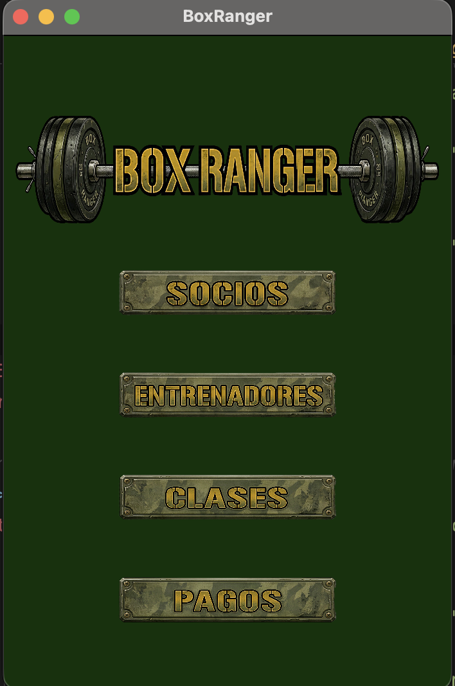
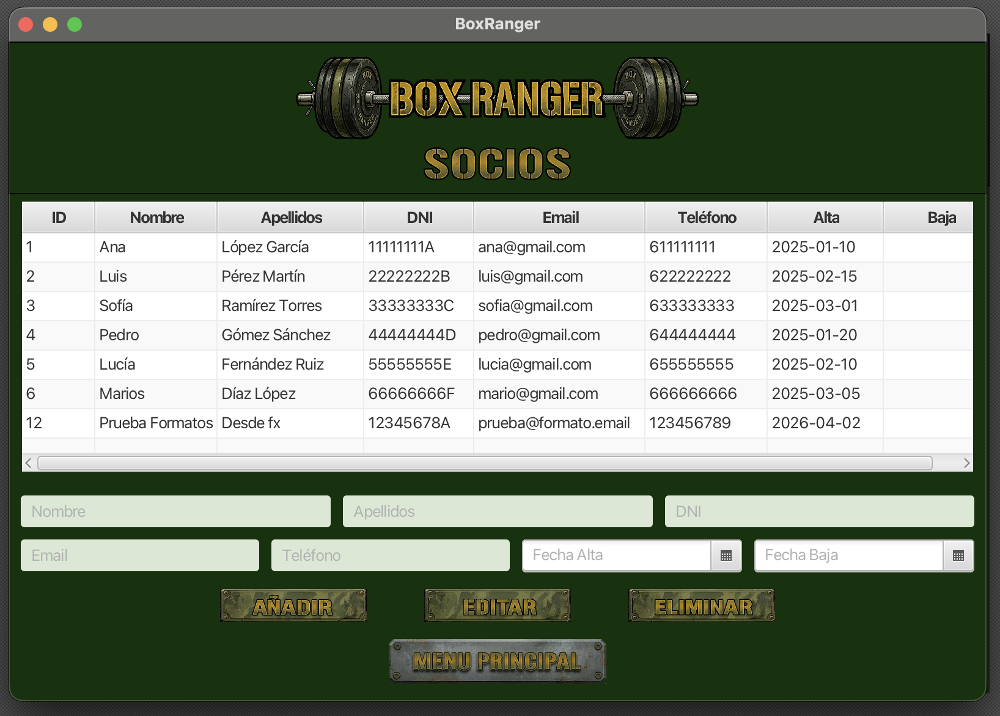
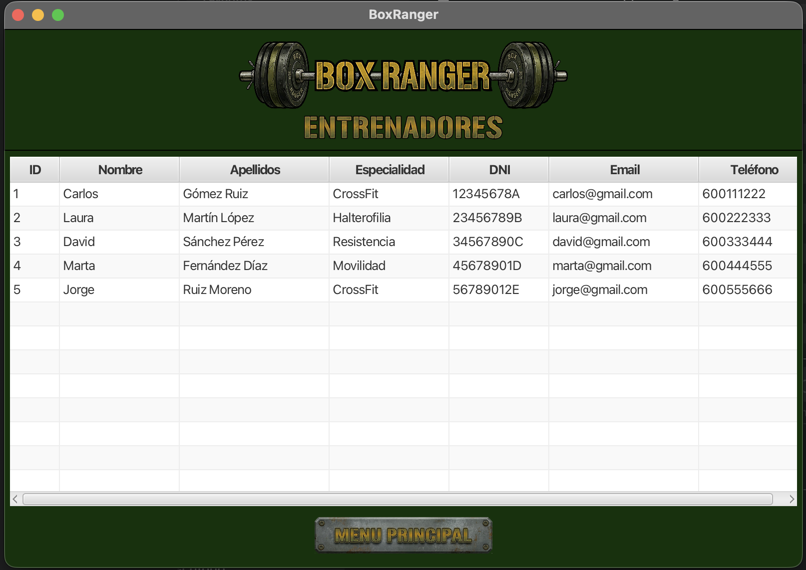
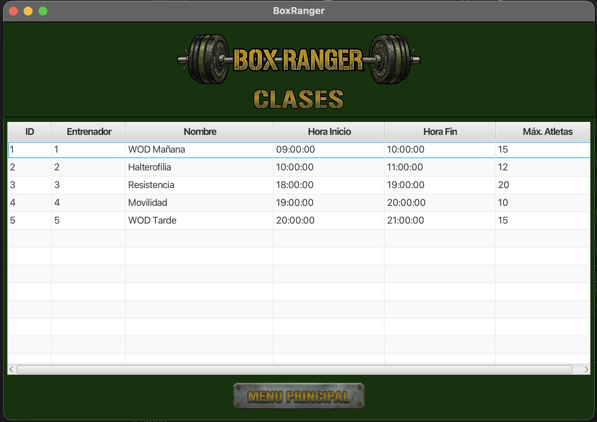
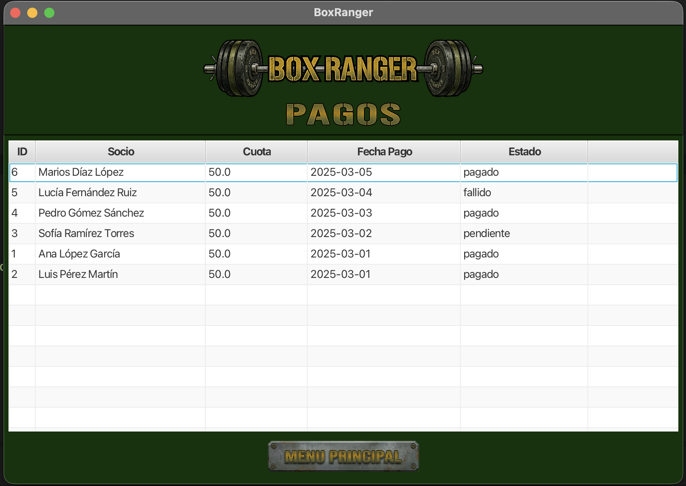

# 🥊 BoxRanger — Gestión de Box de CrossFit

## Descripción

BoxRanger es una aplicación de escritorio desarrollada en Java con JavaFX para la gestión integral de un box de CrossFit. Permite administrar socios, consultar entrenadores, clases y pagos desde una interfaz visual intuitiva.

Este proyecto ha sido desarrollado como **Proyecto Intermodular de 1º de DAM** integrando los conocimientos de múltiples módulos: Bases de Datos, Programación, Lenguajes de Marcas, Sistemas Informáticos, Entornos de Desarrollo y MPO.

---

## 🎯 Problema que resuelve

Un box de CrossFit necesita gestionar de forma centralizada:
- El alta, baja y modificación de socios
- La consulta de entrenadores y sus especialidades
- Los horarios y clases disponibles
- El seguimiento del estado de pagos de los socios

BoxRanger centraliza toda esta información en una aplicación de escritorio conectada a una base de datos MySQL.

---

## 🛠️ Tecnologías utilizadas

| Tecnología | Versión | Uso |
|---|---|---|
| Java (Amazon Corretto) | 21 | Lenguaje principal |
| JavaFX | 21.0.6 | Interfaz gráfica |
| FXML + SceneBuilder | 21 | Diseño de vistas |
| MySQL (MariaDB via XAMPP) | 10.4 | Base de datos |
| JDBC (MySQL Connector) | 8.0.33 | Conexión Java-BD |
| Maven | 3.x | Gestión de dependencias |
| Git + GitHub | — | Control de versiones |
| IntelliJ IDEA | — | IDE de desarrollo |

---

## 📁 Estructura del repositorio

```
BoxRanger/
├── BaseDatos/               # Módulo 0484 – Bases de Datos
│   ├── diagramas/           # Diagrama E/R y Modelo Relacional
│   ├── scripts/             # Scripts SQL de creación, datos y consultas
│   └── README.md            # Documentación del módulo
│
├── Programacion/            # Módulo 0485 – Programación
│   └── BoxRanger/           # Proyecto Java/JavaFX
│       ├── src/
│       │   └── main/
│       │       ├── java/com/boxranger/boxranger/
│       │       │   ├── controller/    # Controladores JavaFX
│       │       │   ├── database/      # DAOs y conexión JDBC
│       │       │   └── modelo/        # Clases entidad
│       │       └── resources/         # FXML e imágenes
│       └── pom.xml          # Configuración Maven
│
├── LenguajesDeMarcas/       # Módulo 0373 – Lenguajes de Marcas
│   ├── datos.xml            # Exportación de datos en XML
│   ├── esquema.xsd          # Esquema de validación XSD
│   └── docs/                # Evidencias de validación
│
├── Sistemas/                # Módulo 0483 – Sistemas Informáticos
│   └── informe-tecnico.md   # Informe del entorno de ejecución
│
├── MPO/                     # MPO – Ampliación de Programación
│   └── README.md            # Documentación de mejoras y arquitectura
│
├── Empleabilidad/           # Módulo 1709 – Empleabilidad
│   └── perfil-profesional.md
│
└── README.md                # Este archivo
```

---

## ⚙️ Instalación y ejecución

### Requisitos previos

- Java 21 (Amazon Corretto recomendado)
- XAMPP con MySQL/MariaDB activo en puerto 8012
- Maven 3.x
- IntelliJ IDEA (recomendado)

### Pasos

1. Clona el repositorio:
```bash
git clone https://github.com/tu-usuario/BoxRanger.git
```

2. Importa el proyecto en IntelliJ IDEA como proyecto Maven.

3. Abre XAMPP y arranca el servicio **MySQL**.

4. Importa la base de datos ejecutando en phpMyAdmin o MySQL Workbench:
```
BaseDatos/scripts/ScriptCreacionBBDD.sql
BaseDatos/scripts/ScriptDatosBBDD.sql
```

5. Verifica que la conexión en `ConexionDB.java` coincide con tu configuración:
```java
private static final String url = "jdbc:mysql://127.0.0.1:8012/BoxRanger";
private static final String usuario = "root";
private static final String contrasena = "";
```

6. Ejecuta la clase `Launcher.java` como clase principal.

---

## 🖥️ Funcionalidades

| Sección | Funcionalidad |
|---|---|
| **Socios** | Listar, añadir, editar y eliminar socios |
| **Entrenadores** | Consultar entrenadores y especialidades |
| **Clases** | Consultar clases y horarios disponibles |
| **Pagos** | Consultar pagos y estados (pagado/pendiente/fallido) |

---

## 🏗️ Arquitectura del proyecto

El proyecto sigue el patrón **MVC (Modelo-Vista-Controlador)** con una capa adicional de acceso a datos (DAO):

```
Vista (FXML)  →  Controlador  →  DAO  →  Base de Datos
     ↑               ↓
  JavaFX          Modelo (entidades Java)
```

- **Modelo:** clases Java que representan las entidades (`Socio`, `Entrenador`, `Clase`, `Pago`, `Inscripcion`)
- **Vista:** archivos FXML diseñados con SceneBuilder
- **Controlador:** clases Java que gestionan los eventos de la interfaz
- **DAO:** clases que encapsulan las consultas SQL mediante JDBC

---

## 📸 Capturas

### Menú Principal


### Gestión de Socios


### Entrenadores


### Clases


### Pagos


> 📌 Para añadir las capturas: crea la carpeta `docs/capturas/` en la raíz del repositorio,
> haz capturas con `Cmd + Shift + 4` en Mac y guárdalas con los nombres indicados.

---

## 👨‍💻 Autor

**Rafal Wozniak Bebenek** — 1º DAM Virtual — Prometeo by The Power  
GitHub: https://github.com/RafitaFuenla/

---

## 📄 Licencia

Proyecto educativo desarrollado para el Proyecto Intermodular de 1º DAM.
